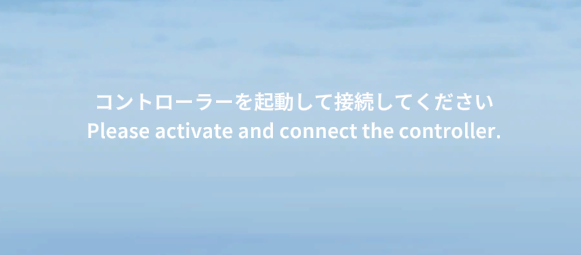
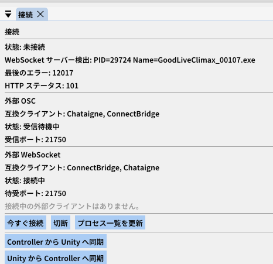
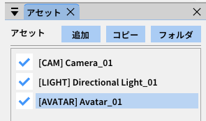
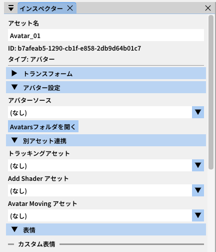

# クイックスタート

## 初めて起動してから最初の演出を出すまでの流れを説明します。

## 起動直後の画面

`GoodLiveClimax.exe` を起動すると、コントローラーと接続するように促す画面が表示されます。

コントローラーを起動すると自動で接続されます。

!!! warning "自動で接続できない場合"
もしコントローラーを起動しても接続されない場合は、コントローラーの接続パネルを確認します
上から三行目のWebsocketサーバー検出が出ているかご確認ください。
Climax本体が無い場合、再起動をお試しください。
基本的には自動で接続されますが、今すぐ接続ボタンで手動で接続することもできます。

---

## 起動直後にすること

起動直後はアセットがありません。
コントローラーのアセットパネルからアセットを追加していきましょう。

## アセットの追加方法

1. 左の **アセットパネル** を開く
2. 追加ボタン、もしくは右クリックメニューからカメラアセットを追加する
3. 同様にディレクショナルライトアセットとアバターアセットを追加する

---

## アセットのパラメータ編集

1. **インスペクターパネル** を開く
2. アセットパネルで編集したいアセットを選択する
3. インスペクターパネルでパラメータを編集する

---

## 映像を確認する

Spout2で映像をOBSに取り込み、配信プレビューで演出を確認してください。

!!! info "Spout2レシーバー"
OBSでSpout2映像を受け取るには [obs-spout2-plugin](https://github.com/Off-World-Live/obs-spout2-plugin) が必要です。
